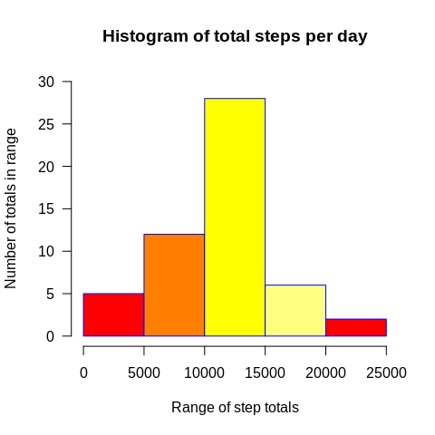
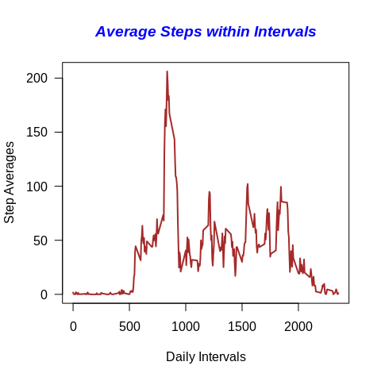
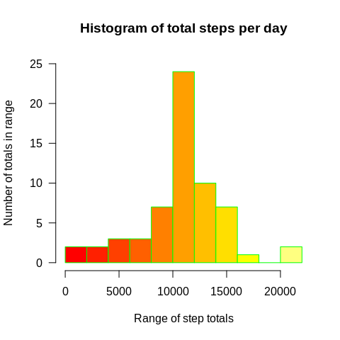
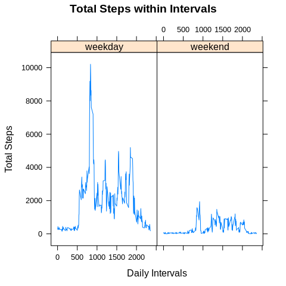

### Adrian Trujillo


## 1 Code for reading in the dataset and/or processing the data

```r
activity <- read.csv("activity.csv", header = TRUE, sep = ',', colClasses = c("numeric", "character", "integer"), stringsAsFactors = F)
str(activity)
```

```
## 'data.frame':	17568 obs. of  3 variables:
##  $ steps   : num  NA NA NA NA NA NA NA NA NA NA ...
##  $ date    : chr  "2012-10-01" "2012-10-01" "2012-10-01" "2012-10-01" ...
##  $ interval: int  0 5 10 15 20 25 30 35 40 45 ...
```


## 2 Histogram of the total number of steps taken each day

```r
complete_days_only <- activity[complete.cases(activity), ]
step_summary  <-  complete_days_only %>% 
                  group_by(date) %>% 
                  summarise(daily_step_count = sum(steps),.groups = 'drop')

hist(step_summary$daily_step_count, 
    main = "Histogram of total steps per day",
    xlab = "Range of step totals",
    ylab = "Number of totals in range",
    border = "blue",
    col = heat.colors(4),
    las = 1,
    ylim = c(0, 30))
```

<!-- -->


## 3 Mean and median number of steps taken each day

```r
mean_steps <- mean(step_summary$daily_step_count, na.rm = TRUE)
median_steps <- median(step_summary$daily_step_count, na.rm = TRUE)
mean_and_median <- data.frame(Mean = mean_steps, Median = median_steps)
mean_and_median
```

```
##       Mean Median
## 1 10766,19  10765
```


## 4 Time series plot of the average number of steps taken

```r
x  <- complete_days_only %>% 
      group_by(interval) %>% 
      summarise(avg_interval = mean(steps),.groups = 'drop')

plot(x$interval, 
     x$avg_interval, 
     type = "l", 
     las = 1, 
     col = "brown", 
     main = "Average Steps within Intervals",
     lwd = 2,
     col.main = "blue",
     font.main = 4,
     xlab = "Daily Intervals",
     ylab = "Step Averages"
     )
```

<!-- -->

## 5 The 5-minute interval that, on average, contains the maximum number of steps

```r
x[which.max(x$avg_interval), ]
```

```
## # A tibble: 1 x 2
##   interval avg_interval
##      <int>        <dbl>
## 1      835         206.
```


## 6 Code to describe and show a strategy for imputing missing data
Total number of rows:

```r
nrow(activity)
```

```
## [1] 17568
```

Rows without NA


```r
nrow(complete_days_only)
```

```
## [1] 15264
```
Rows with NA


```r
difference <- nrow(activity) - nrow(complete_days_only)
difference
```

```
## [1] 2304
```

Fill the missing data with ramdom numbers

```r
set.seed(10)
z  <- floor(runif(nrow(activity), 
                  min = min(activity$steps, na.rm = T), 
                  max = max(activity$steps, na.rm = T)/10))
w <- which(is.na(activity$steps))
activity$steps[w] <- z[w]
```

## 7 Histogram of the total number of steps taken each day after missing values are imputed

```r
complete_data  <- activity %>% 
                  group_by(date) %>% 
                  summarise(daily_step_count = sum(steps),.groups = 'drop')

hist(complete_data$daily_step_count, 
    breaks = 10,
    main = "Histogram of total steps per day",
    xlab = "Range of step totals",
    ylab = "Number of totals in range",
    border = "green",
    col = heat.colors(12),
    las = 1,
    ylim = c(0, 25))
```

<!-- -->

## 8 Panel plot comparing the average number of steps taken per 5-minute interval across weekdays and weekends
Determine if there are differences in activity patterns between weekdays and weekends

```r
activity$date <- as.POSIXct(activity$date)
activity$dayType  <- ifelse(weekdays(activity$date) %in% c(weekdays(as.POSIXct("2020-06-06")),weekdays(as.POSIXct("2020-06-06"))), "weekend", "weekday")

activity$dayType  <- as.factor(activity$dayType)
q  <- activity %>% 
      group_by(dayType, interval) %>% 
      summarise(daily_step_count = sum(steps),.groups = 'drop')
q
```

```
## # A tibble: 576 x 3
##    dayType interval daily_step_count
##    <fct>      <int>            <dbl>
##  1 weekday        0              295
##  2 weekday        5              286
##  3 weekday       10              438
##  4 weekday       15              252
##  5 weekday       20              277
##  6 weekday       25              276
##  7 weekday       30              301
##  8 weekday       35              363
##  9 weekday       40              381
## 10 weekday       45              260
## # … with 566 more rows
```

Create a time series plot of total steps within intervals comparing weekdays vs weekends

```r
with(q, 
      xyplot(daily_step_count ~ interval | dayType, 
      type = "l",      
      main = "Total Steps within Intervals",
      xlab = "Daily Intervals",
      ylab = "Total Steps"))
```

<!-- -->

## The diagram above suggests that people walk less on weekends


